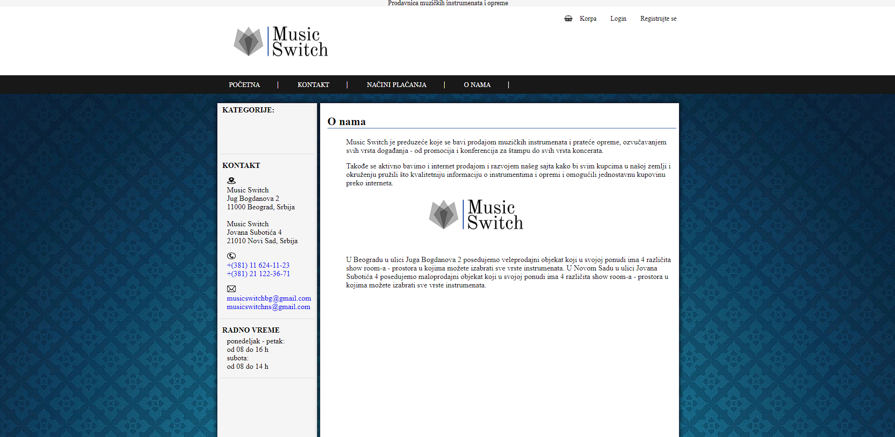
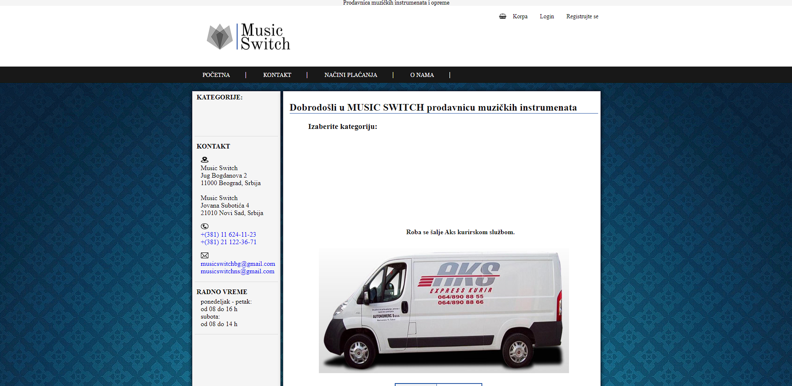

# Music-switch
 
 This is my first major project created by me using the ```Java``` programming language. It reflects my progress in software development and highlights my commitment to learning and delivering innovative solutions.

This website is designed for ```selling musical instruments``` and other equipment for musical instruments. The website is user-friendly, allowing users to easily and quickly access the desired information while navigating through the site.



### Appearance and functionality of the application

Every user who decides to purchase a product must register. Registration is done by clicking on 'Register' in the upper right corner. When the user clicks the button, a new page appears where the user needs to fill in mandatory fields, such as first name, last name, contact information (phone and email), password, street and number, city, state, postal code, and by clicking the 'Register' button, the user gets registered in the website's database.



After registration, the user must log in to access the shopping cart and add desired items to it for making a purchase. To access the login, the user needs to click on 'Login' next to the 'Register' and 'Cart' fields. Clicking on login opens a new page where the user needs to enter the credentials - email and password used during registration. If the user fills in the email and password fields incorrectly, an 'error' message will be displayed. If the user successfully logs in, they are redirected to the homepage and can use the cart. If the user doesn't log in, they are not allowed to use the cart until they register. This website is accessible to everyone, but if a user wants to purchase one or more products, they must log in.


## Database model

In the cart, a logged-in user can view the items they added by clicking the 'Add to Cart' button. The desired items are displayed on the page. If the user accidentally added an item or doesn't want to purchase a particular product, they can remove it from the cart by clicking the 'Delete' button. Once the user has finished selecting items, they proceed by clicking the 'Continue' button.

After clicking the button, a new page appears, showing the total price of all selected items, along with quantities if the user chose multiple identical products. A new option for selecting the payment method also appears. The user must choose between two payment options: Cash on Delivery or Bank Transfer. The user can find more information about payment methods by clicking 'Payment Methods' in the navigation bar.

After reviewing everything, the user proceeds by clicking the 'Complete Purchase' button. This opens a new page displaying the user's receipt. This page also shows the information entered during registration (First Name, Last Name, contact phone, address, city, state, postal code). The receipt includes user details (buyer), the selected items, the final price, and information about when to expect the desired items.


In the main section of the website, on the left side, there's a selection of categories. Below that, you can find contact phone numbers, addresses, emails, and store working hours. On the right side of each page, the content is displayed based on the page you're on.

Each category has several subcategories. The categories on this site include:

    - Guitars (Electric Guitars, Acoustic Guitars, Bass Guitars, Classical Guitars, guitar accessories, and Strings)
    - Drums and Percussion (Acoustic Drums, Electronic Drums, drum accessories, and Drum Hardware)
    - Keyboard Instruments (Keyboards, Pianos, and keyboard accessories)
    - Sound Equipment (Amplifiers, Mixers, Speakers, and Microphones)
    - Accessories and Equipment (Cables, Music Stands, Metronomes)

When a user clicks on a desired category, a page opens displaying the subcategories within that chosen category. Clicking on a subcategory reveals a page that lists all the items in that particular subcategory. Each item is shown with its name, image, and description.

Clicking the button of a desired item opens a new page where the user can view details exclusively about that item. The page displays the item's name, description, features, image, and price. Additionally, there's a button labeled 'Add to Cart'. When the user adds an item to the cart, a confirmation message appears. If the user wants to add more items to the cart, they can return to the subcategory page and continue selecting desired items.